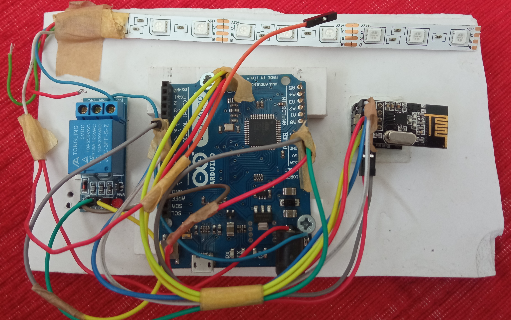

### **Raspberry Pi Tasarruflu Ev**

Son zamanlarda akıllı evler gözde kavramlardandır. Akıllı evlerde tasarruf için birçok senaryo uygulanmaktadır. Çeşitli sensörler kullanılarak evin durumu gözlenerek tasarruf durumu belirlendiğinde lambalar vb. cihazlar kapatılmaktadır. Hareket sensörleri (PIR vb.) ile genellikle hareket algılanmaktadır. Fakat hareket sensörleri hareketsizlik durumunda odadaki kişileri tespit edememektedir. Bu durumda kamera kullanmak daha iyi sonuçlar elde edilmesini sağlamaktadır. Aydınlık karanlık durumlarında da kamera ve hareket sensörlerinin beraber kullanılması daha iyi sonuç elde edlmesini sağlamaktadır.

Bu amaçla bir odada Raspberry Pi (RPi) ile kamera modülü üzerinden yüz tanıma işlemi gerçekleştirilmiştir. Yüz tanıma sonucunda oda da hiç kimse yoksa ve belli bir süre bu durumda ise odanın ışığı lamba-priz modülüne kablosuz olarak gönderilen kapatma bilgisi ile odada bulunan lamba ve diğer çalışan elektronik cihazlar kapatılmaktadır.

Hareket sensöründen veya RPi kamera üzerinden yüz tanıma bilgisi oluştuğunda ise lamba-priz modülüne açma bilgisi kablosuz olarak gönderilmektedir.

Lamba modülü olarakta Arduino Leonardo ile birlikte NRF24L01 kablosuz modül ve röle modülü kullanılmıştır.

Böylece herhangi bir odada hiç kimse yokken o odada bulunan lambalar ve elektronik cihazlar gereksiz yere çalışmamaktadır. Bu durum da ev içersinde veya herhangi bir ofis benzeri ortamda elektrik tasarrufu sağlayacaktır.

Ayrıca bir ev içersinde düğmelere-butonlara gerek kalmadan bütün evdeki lambalar otomatik olarak kendiliğinden açılıp kapanabilecektir. Wifi özelliği olan bir RPi modülü kullanılırsa da evdeki durum web üzerinden izlenebilecek ve sistem ev güvenliği için de kullanılabilecektir.

Burada RPi kamera üzerinden yüz tanıma ve gerekirse web bağlantısı için kullanılmaktadır. Maliyet açısından bu temel özelliklere uygun RPi seçilebilir. Ayrıca RPi ile birlikte programlama kolaylığı açısında Arduino UNO bir NRF24L01 wifi modül ile kullanılmıştır. RPi kablosuz komutları Arduino-NRF modül üzerinden alıp göndermektedir.

RPi de işlemler (Yüz tanıma, USB-seri haberleşme vb.) Python dili ile gerçekleşirilirken Arduino kartlarda C++ dili kullanılmıştır.

### Kullanılan Teknolojiler :

- Rasberry Pi 3B
- Python programlama dili, yüz tanıma, usb-seri haberleşme
- NRF24L01 wifi haberleşme
- Akıllı evler